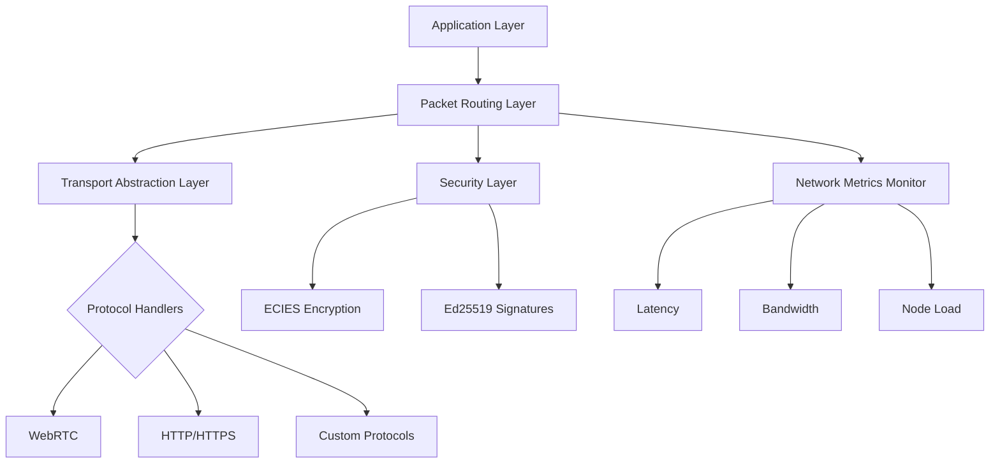

# SuperNet - 고성능 오버레이 네트워크 엔진  
# SuperNet - High Performance Overlay Network Engine  

[](LICENSE)
[](https://golang.org/)
[](docs/rfc/)

트랜스포트 레이어 추상화와 패킷 스위칭 기반의 고성능 오버레이 네트워크 엔진  
High-performance overlay network engine with transport layer abstraction and packet switching capabilities.

## 주요 기능 / Key Features
- 🔌 **다중 프로토콜 지원**: WebRTC, HTTP/HTTPS, WS/WSS, TCP/UDP 등
  **Multi-protocol Support**: WebRTC, HTTP/HTTPS, WS/WSS, TCP/UDP, etc.
- ⚡ **레이턴시 최적화 라우팅**: 실시간 네트워크 메트릭 기반 경로 선택  
  **Latency-optimized Routing**: Real-time network metric based path selection
- 🔄 **동적 부하 분산**: 노드 리소스 사용량에 따른 트래픽 분배  
  **Dynamic Load Balancing**: Traffic distribution based on node resource usage
- 🔒 **엔드투엔드 암호화**: ECIES + Ed25519 조합의 강력한 보안  
  **End-to-end Encryption**: Strong security with ECIES + Ed25519 combination
- 🌐 **네트워크 분리 지원**: 숫자 기반 네트워크 ID 격리
  **Network Isolation**: Numeric network ID based isolation

## 아키텍처 개요 / Architecture Overview


## 시작하기 / Getting Started
### 설치 요구사항 / Prerequisites
- Go 1.22 이상 / Go 1.22+
- WebRTC 지원을 위한 C 컴파일러 / C compiler for WebRTC support
- OpenSSL 라이브러리 / OpenSSL libraries

### 설치 / Installation
```bash
# Install main package
go get gosuda.org/supernet

# Install required dependencies
go get github.com/pion/webrtc/v3
go get google.golang.org/protobuf
```

### 기본 사용 예제 / Basic Usage Example
```go
package main

import (
	"github.com/gosuda/supernet/core"
	"github.com/gosuda/supernet/config"
)

func main() {
	cfg := config.DefaultConfig()
	cfg.NetworkID = "mainnet"
	cfg.TransportProtocols = []string{"webrtc", "https"}
	
	node, err := core.NewNode(cfg)
	if err != nil {
		panic(err)
	}
	
	// Start network node
	if err := node.Start(); err != nil {
		panic(err)
	}
	
	// Register packet handler
	node.OnPacket(func(p *core.Packet) {
		fmt.Printf("Received packet from %s\n", p.Source)
	})
	
	// Keep node running
	select {}
}
```

## 고급 사용법 / Advanced Usage
### 커스텀 프로토콜 등록
```go
// Custom protocol implementation
type MyProtocol struct{}

func (p *MyProtocol) HandlePacket(data []byte) {
	// Custom packet handling logic
}

// Register custom protocol
node.RegisterProtocol("myproto", &MyProtocol{})
```

### 멀티패스 라우팅 설정
```go
cfg.Routing.Multipath = true
cfg.Routing.MaxParallelPaths = 3
cfg.Routing.MetricWeights = config.MetricWeights{
	Latency:   0.6,
	Bandwidth: 0.3,
	Reliability: 0.1,
}
```

## 문서 / Documentation
- [RFC-0001: 오버레이 네트워크 아키텍처](docs/rfc/0001-overlay-network-architecture.md)  
  - Core architecture and component relationships
- [RFC-0002: 주소 형식 사양](docs/rfc/0002-multiaddress-format.md)
  - Address format specification and encoding rules
- [RFC-0003: 패킷 라우팅 프로토콜](docs/rfc/0003-packet-routing.md)  
  - Packet routing algorithms and congestion control

## 기여하기 / Contributing
기여를 원하시는 경우 다음 가이드라인을 준수해 주세요:  
Please follow these guidelines when contributing:

1. 기능 추가/변경 시 RFC 제안 먼저 생성  
   Create an RFC proposal for new features or major changes
2. Go 코드 스타일 가이드 준수  
   Follow Go code style guidelines
3. 테스트 커버리지 80% 이상 유지  
   Maintain at least 80% test coverage
4. 변경 사항에 대한 문서 업데이트  
   Update documentation for all changes

## 라이선스 / License
[MIT License](LICENSE) - 자세한 내용은 LICENSE 파일 참조  
See LICENSE file for full details.
