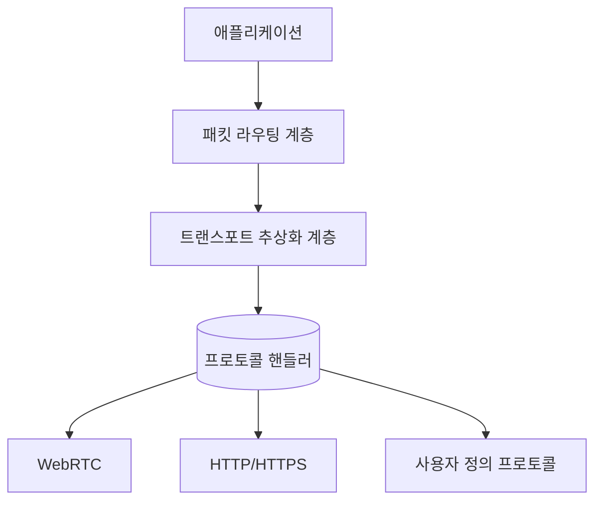

# SuperNet - 고성능 오버레이 네트워크 엔진

[](LICENSE)

트랜스포트 레이어 추상화와 패킷 스위칭 기반의 고성능 오버레이 네트워크 엔진

## 주요 기능
- 🔌 **다중 프로토콜 지원**: WebRTC, HTTP/HTTPS, TCP/UDP 등
- ⚡ **레이턴시 최적화 라우팅**: 실시간 네트워크 메트릭 기반 경로 선택
- 🔄 **동적 부하 분산**: 노드 리소스 사용량에 따른 트래픽 분배
- 🔒 **엔드투엔드 암호화**: ECIES + Ed25519 조합의 강력한 보안
- 🌐 **네트워크 분리 지원**: I2P 스타일 네트워크 ID 기반 격리

## 아키텍처 개요


## 시작하기
### 설치
```bash
go get github.com/gosuda/supernet
```

### 기본 사용 예제
```go
import "github.com/gosuda/supernet/core"

func main() {
    config := core.DefaultConfig()
    node := core.NewNode(config)
    node.Start()
}
```

## 문서
- [아키텍처 명세서](docs/rfc/0001-overlay-network-architecture.md)
- [멀티어드레스 형식](docs/rfc/0002-multiaddress-format.md)
- [패킷 라우팅 프로토콜](docs/rfc/0003-packet-routing.md)

## 기여하기
기여 가이드라인은 [CONTRIBUTING.md](CONTRIBUTING.md) 참조

## 라이선스
[MIT License](LICENSE)
