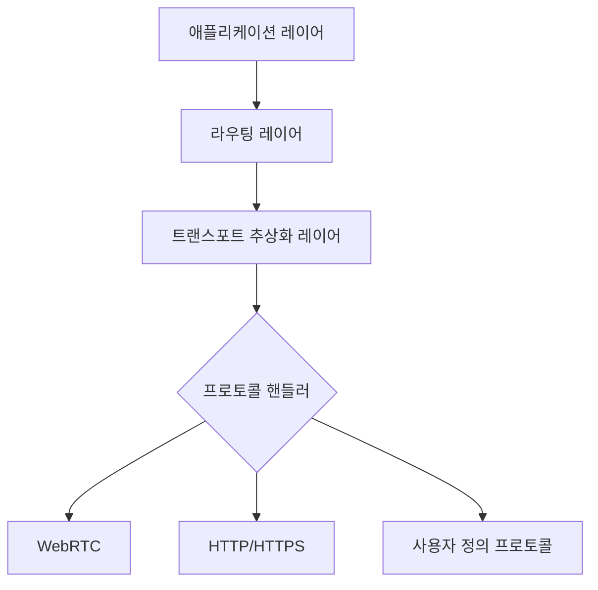

# RFC-0001: 오버레이 네트워크 아키텍처

## 1. 소개
### 1.1. 설계 목표
- 프로토콜 유연성을 위한 트랜스포트 레이어 추상화
- 패킷 스위칭 기반의 라우팅 코어
- 레이턴시 우선 + 부하 분산 라우팅
- 네트워크 ID를 통한 다중 네트워크 지원
- 공개키 기반 주소 체계

## 2. 아키텍처 개요


## 3. 핵심 구성 요소
### 3.1. 트랜스포트 레이어
- **WebRTC 지원**: ICE/STUN/TURN 통합
- **HTTP 터널링**: CONNECT 메소드 기반 터널링
- **확장성**: 새로운 프로토콜을 위한 플러그인 아키텍처

### 3.2. 보안 레이어
- 패킷 페이로드 ECIES 암호화
- 패킷 헤더 Ed25519 서명
- 네트워크 ID 별 키 분리 관리

## 4. 네트워크 운영
### 4.1. 피어 발견
- 네트워크 ID 분할 Kademlia DHT
- 부트스트랩 노드 렌데부 프로토콜

### 4.2. 라우팅 메트릭
- 실시간 레이턴시 측정
- 노드 부하 점수 알고리즘:
  ```
  점수 = (1 / 레이턴시) * (1 / CPU_부하) * 사용가능_대역폭
  ```
  
### 4.3. 다중 경로 관리
- 동적 경로 탐색 및 유지 관리
- 장애 발생 시 자동 경로 전환
- 부하 분산을 위한 가중치 기반 트래픽 분배

## 5. 보안 고려사항
- 엔드투엔드 암호화 필수 적용
- 네트워크 ID 기반 트래픽 격리
- 작업 증명(PoW) 기반 DDoS 방어
- 공개키 기반 인증 및 권한 관리

## 6. 성능 최적화
- Zero-copy 패킷 처리 파이프라인
- 메모리 풀 기반 자원 재사용
- 벡터화된 패킷 처리 연산
