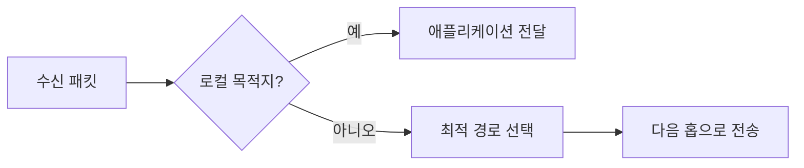

# RFC-0003: 패킷 라우팅 명세서

## 1. 소개
### 1.1. 설계 원칙
- 패킷 스위칭 기반 라우팅 코어
- 레이턴시 인식 경로 선택
- 동적 부하 분산
- 다중 경로 장애 조치 지원

## 2. 패킷 형식

## 3. 라우팅 알고리즘
### 3.1. 핵심 구성 요소
- **레이턴시 모니터**: 실시간 RTT 측정
- **부하 평가기**: 노드 자원 사용량 메트릭
- **경로 관리자**: 다중 경로 유지 관리

### 3.2. 라우팅 결정 프로세스


### 3.3. 경로 점수 계산 공식
```
점수 = (1 / 레이턴시_ms) * (1 / CPU_사용률) * (사용가능_대역폭_Mbps / 100)
```

## 4. 라우팅 운영
### 4.1. 경로 탐색
- 30초 간격 사전 경로 탐색
- 수요 기반 반응적 경로 탐색
- 피어 조회를 위한 Kademlia DHT

### 4.2. 장애 처리
- 타임아웃 시 자동 경로 재선택
- 불안정 노드 블랙리스트 (5분 내 3회 실패)
- TTL 기반 루프 방지

## 5. 부하 분산
### 5.1. 트래픽 분배
- 노드 점수 기반 가중치 라운드 로빈
- 상태 유지 프로토콜을 위한 흐름 선호도
- 버스트 트래픽 평활화

## 6. 구현 예제
```go
func 최적경로선택(패킷 *pb.RoutingPacket) *Route {
    최고경로 := &Route{}
    최고점수 := 0.0

    for _, 경로 := range 가능한경로들 {
        점수 := (1 / 경로.평균레이턴시) * 
### 4.4. 노드 메타데이터 스키마
```protobuf
import "proto/maddr/v1alpha1/maddr.proto";

message NodeMetadata {
  maddr.AddressList address = 1; // Node address
  Identity identity = 2; // Node identity
}
```
               (1 / 경로.노드부하) * 
               (경로.사용가능대역폭 / 100)
        
        if 점수 > 최고점수 {
            최고점수 = 점수
            최고경로 = 경로
        }
    }
    return 최고경로
}

// 한국어 주석 추가
// 가중치 계산: 레이턴시, 부하, 대역폭 고려
// 최고 점수 경로 선택
```

## 7. 보안 고려사항
- 홉별 세션 키 암호화
- 서명 체인을 통한 경로 검증
- DDoS 방지를 위한 속도 제한
- 패킷 위변조 방지 메커니즘

## 8. 성능 모니터링
- 실시간 라우팅 메트릭 대시보드
- 패킷 손실률 추적 시스템
- 자동 규모 조정 메커니즘

### 5.2. 서명 및 신원 스키마
```protobuf
enum Algorithm {
  ED25519 = 0;
  ED448 = 1;

  MLDSA44 = 2;
  MLDSA65 = 3;
  MLDSA87 = 4;

  X25519 = 5;
  X448 = 6;

  MLKEM512 = 7;
  MLKEM768 = 8;
  MLKEM1024 = 9;
}

enum MultiSignaturePolicy {
  REQUIRE_ALL = 0; // All signatures are required
  REQUIRE_ANY = 1; // Any signature is sufficient
  REQUIRE_QUORUM = 2; // A quorum of signatures is required
}

message SignaturePolicy {
  int64 total_signers = 1; // Total number of available signers
  int64 total_signatures = 2; // Total number of signatures
  int64 threshold = 3; // Minimum number of vaild signatures required
  MultiSignaturePolicy multi_signature = 4; // Type of multi-signature policy
}

message SignaturePayload {
  int64 timestamp = 1; // Unix timestamp in seconds
  int64 nonce = 2; // Unique nonce for the signature
  SignaturePolicy policy = 3; // Signature policy
  bytes data = 4; // Data to be signed
}

message PublicKey {
  Algorithm algorithm = 1;
  bytes key = 2;
}

message Signature {
  Algorithm algorithm = 1;
  bytes signature = 2;
}

message Identity {
  repeated PublicKey public_keys = 1; // List of public keys
}
```
